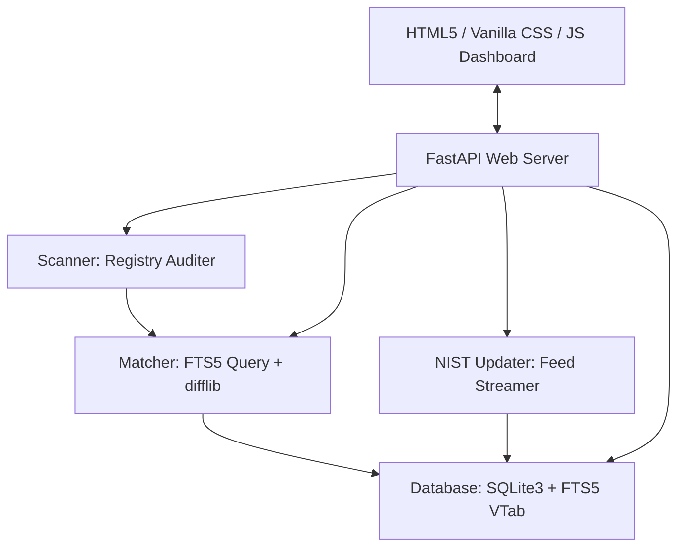

# SentinelCVE

> A premium, modern local vulnerability scanner that audits installed software assets, maps them to official NIST CPE (Common Platform Enumeration) references, and identifies matching CVE (Common Vulnerabilities and Exposures) records.

SentinelCVE is an enhanced, production-ready reboot of the `SoftwareCPE-CVEMatcher` project. It introduces a high-performance local SQLite FTS5 search index, automated local asset scanning, automated NIST data synchronizers, and a state-of-the-art dark-mode glassmorphic web dashboard.

---

## Key Features

- **Automated Asset Auditing**: Scans local Windows registry hives directly (via `winreg`) to inspect installed programs, versions, and publishers, eliminating manual CSV collation.
- **High-Performance SQLite FTS5 Matcher**: Replaces slow CPU similarity loops with SQLite's virtual Full-Text Search indexing, reducing CPE lookup times from hours to milliseconds.
- **Automatic NIST Syncing**: Download and process gzip-compressed XML CPE dictionaries and recent NVD CVE JSON feeds directly from NIST.
- **Premium Glassmorphic UI**: High-end dark theme dashboard with real-time severity metrics (Critical, High, Medium, Low), filterable asset lists, and expandable vulnerability descriptions.
- **Pre-seeded Dataset**: Comes pre-configured with popular vulnerability models (e.g. Chrome, Firefox, Zoom, Git, VLC) to demonstrate matching out-of-the-box.

---

## Architecture Flow



---

## Quick Start

### 1. Prerequisites
Ensure you have Python 3.9+ installed on your system.

### 2. Installation
Navigate to your project directory and install the necessary library dependencies:
```powershell
pip install -r requirements.txt
```

### 3. Verification Test
Run the local verification suite to test the database, local scanner, and CPE-CVE resolution:
```powershell
python verify_scanner.py
```

### 4. Running the Dashboard
Start the application launcher:
```powershell
python main.py
```
This initializes the databases, boots the FastAPI API server, and automatically opens your web browser to the dashboard at:
`http://localhost:8000`

---

## Project Structure

```text
sentinel-cve/
├── app/
│   ├── __init__.py
│   ├── database.py       # SQLite connection, schemas, and pre-seeded mock records
│   ├── scanner.py        # Windows registry reader with testing mock fallbacks
│   ├── matcher.py        # SQLite FTS5 matching engine and similarity checks
│   ├── updater.py        # Async NIST XML/JSON compressed feed parser
│   └── server.py         # FastAPI endpoints and static web routing
├── web/
│   ├── index.html        # Front-end structure, layout grids, and modals
│   ├── style.css         # Glassmorphism dark-mode stylesheet and transitions
│   └── app.js            # Tab controller, async API triggers, and chart rendering
├── main.py               # Main launcher thread & automatic browser launch
├── verify_scanner.py     # End-to-end local validation test script
├── github_uploader.py    # Custom git-less API uploader
└── requirements.txt      # Project library dependencies
```

---

## How to Sync with NIST
1. Navigate to the **NIST Database** tab in the dashboard.
2. Click **Sync NIST Feeds**.
3. The server will download and process the official data feeds in the background. The current status and metrics will update in real-time.
